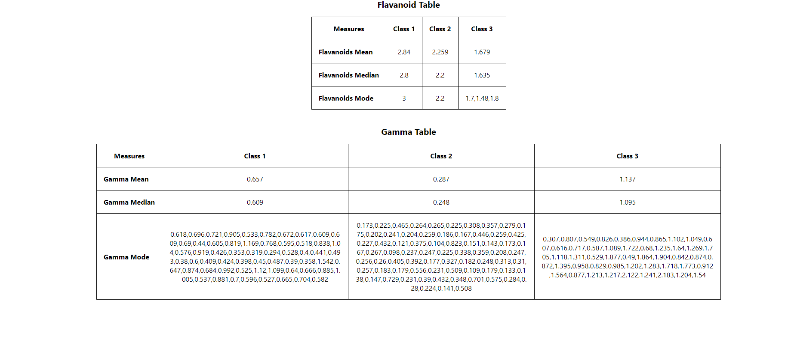

# manufac_wine

A web application to see tabular calculations performed upon the wine dataset.

## Installation

A step-by-step guide to installing and setting up the project.

## Clone the repository

git clone https://github.com/aayushvirkar/manufac_wine.git

## Navigate to the project directory

cd wine_app

## Install dependencies

yarn install

## Start the development server

yarn start
